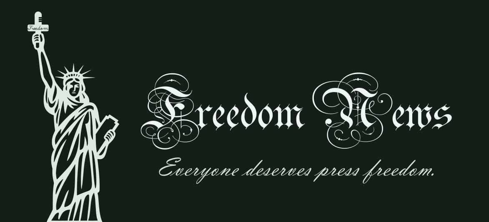

# Freedom News - Everyone deserves press freedom

*A Nostr Client Defending Press Freedom*

## Official version

[Freedom-News 1.0.1 (https://freedom-news.vercel.app/)](https://freedom-news.vercel.app/)

## Developing

```sh
npm i
npm run dev
```

## Building

```sh
npm run build
Copy-Item -Path "./src/assets" -Destination "./dist/src/assets" -Recurse
npm run preview
```

Preview the built version and check if everything is ok. (Sometimes there will be some strange errors after building. )

## About this app and myself

Hi, there! I am a middle school student in Eastern Asia. Therefore, I am not so free at doing things I like (now as contributing for press freedom), but I still tried my best to make this little web app out. I am going to school soon, and this app is currently very simple and conceptual.

A few month later I read some reports about press freedom in our world, and found some disadvantages of current news apps:

1. Most of them are centralized, which means that governments can easily shut down or manipulate them when they want to (especially in Mainland China).
2. At least for now, news apps I saw all focus on publishers. Which means that a publisher with 100,000 followers is much more powerful than a publisher with few followers, which also might tell some kinds of truth.

So, I try my best to make this app out, giving a try of event-organizing and decentralized news app. (Believe it or not, this is my first vue project.)

## Donating

I will be really appreciated if somebody who likes my idea can give some money to me, so I can continue developing this app. And also I want to move to America or some other democratic countries since my mother country doesn't really like my work, they probably will send me into jail if they found me in real life. 😰

My bitcoin address: bc1qfsvrpsupeqa4wwf2wdh00ny6va09cl8yqfz8x9

Or QR code of Bitcoin address:


## Plans

As I said, this app is still very simple and conceptual. These are what I planned to add or do when I am free:

 - A credibility assessment system which depends on the evidences
 - Better UI and UX
 - A more decentralized CDN (Since Nostr doesn't support heavy content, I used nostr.build for images, videos, and audios, pdf, docx or other documents are still not supported.)
 - An AI-based analyzing system for tracking people or other event-related things.
 - DMs
 - Search
 - Performance optimizing
 - ...

A lot of things to do!

That't it, bye!